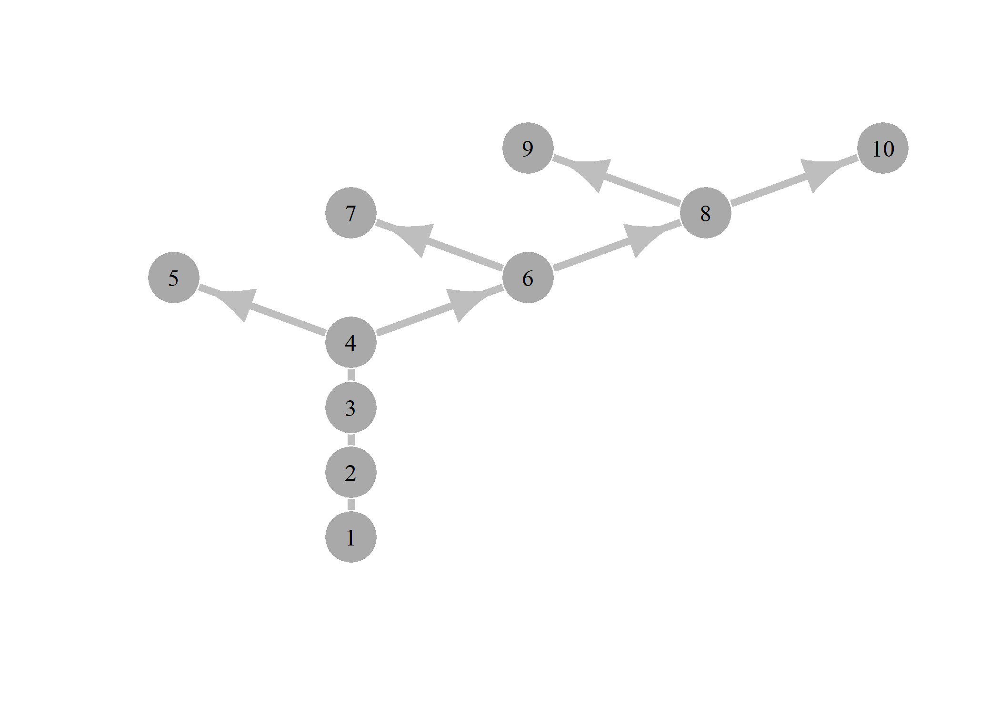
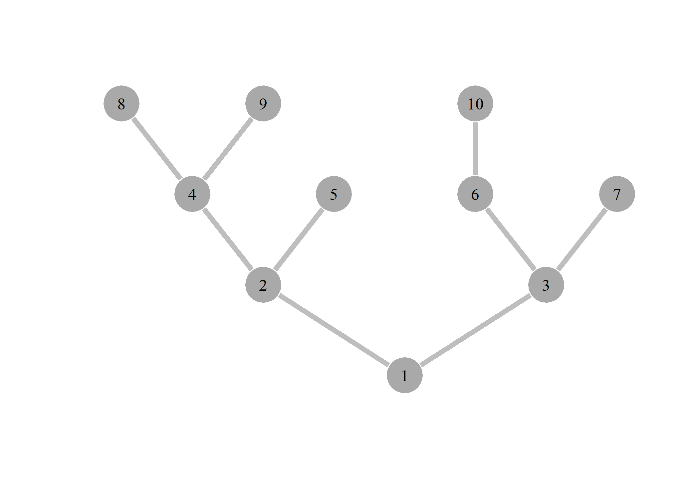

<!-- README.md is generated from README.Rmd. Please edit that file -->

<!-- badges: start -->

<!-- badges: end -->

A few functions used for creating and manipulating dendritic networks,
mainly wrappers for various igraph functions.

### Installation

``` r
# devtools::install_github("flee598/DenMet")
library(DenMet)
library(igraph)
```

### Create a dendritic network with 10 nodes

``` r
nwk <-  fun_crtNwk(10, "int")
fun_pltNwk(nwk$ig, direct = "out", edge.arrow.size = 2)
```

<!-- -->

# Downstream network, hide arrows

``` r
g <- nwk$adjDwn
g <- igraph::graph.adjacency(g)
fun_pltNwk(g, "in", edge.arrow.size = 0)
```

<!-- -->

# Add strahler order to graph nodes

``` r
g <- fun_strahler_order(g)
igraph::get.vertex.attribute(g)
#> $strahler
#>  [1] 2 2 2 2 1 1 1 1 1 1
```
